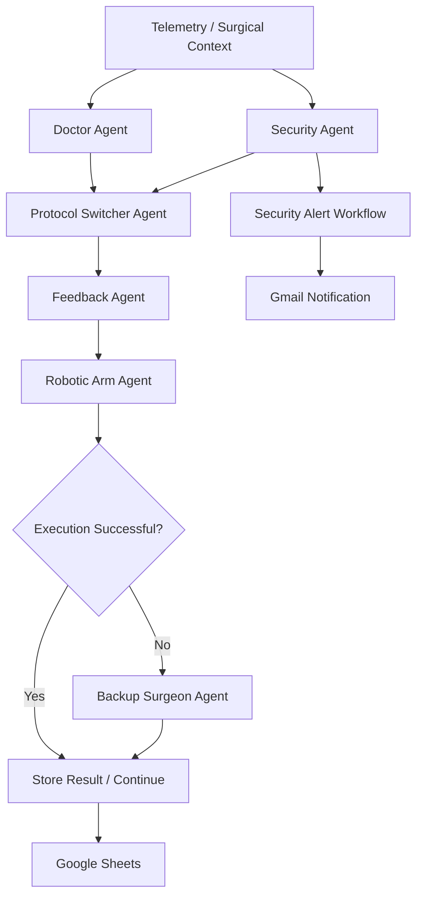
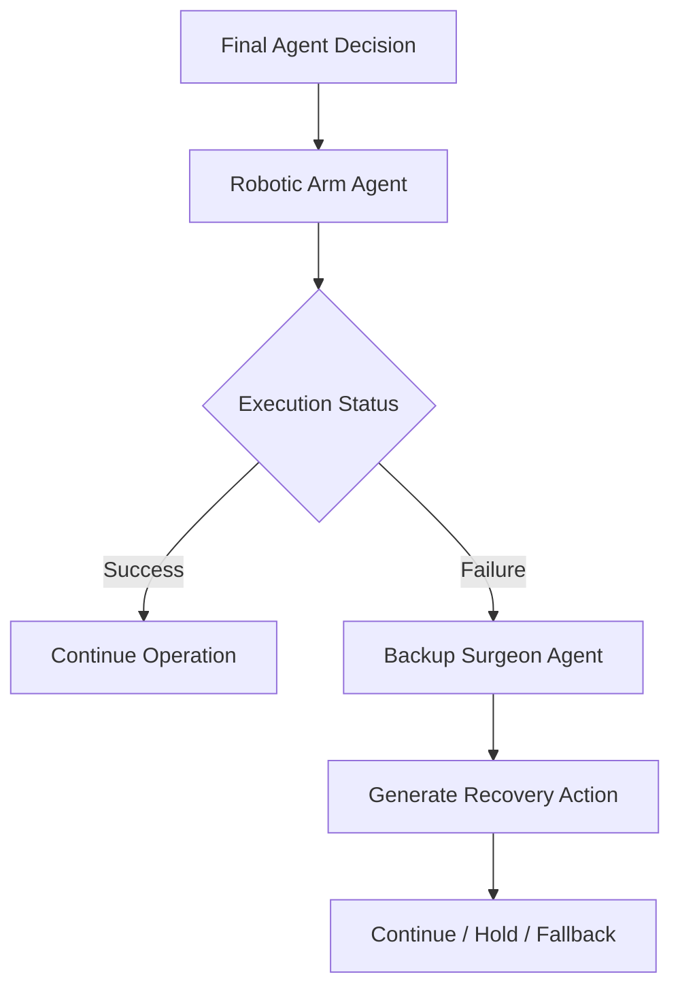

# Agentic Telesurgery Control System

> A multi-agent AI orchestration prototype for secure and fault-tolerant remote telesurgery, coordinating surgical decision-making, security monitoring, network protocol adaptation, execution, feedback, and automated failover.

> The project is a research prototype and simulation of an agentic telesurgery control architecture. It is not intended for real-world clinical use.

## Proposed Approach Architecture:


## Telesurgery Workflow:


## MCP Server:


## MCP Server Receiver:


## System Architecture



### Control loop

```text
Observe
   ↓
Detect
   ↓
Reason
   ↓
Decide
   ↓
Act
   ↓
Evaluate
   ↓
Recover if required
```

**Built with:** n8n · Google Gemini · REST APIs · Webhooks · Google Sheets · Gmail · GitHub

## The Problem

Remote telesurgery requires more than simply sending commands from a surgeon to a robotic system.

The communication layer must continuously deal with:

- network latency and packet loss,
- unstable connectivity,
- possible cyberattacks,
- protocol selection,
- execution failures,
- and the need for safe fallback behaviour.

Instead of treating these as isolated problems, I explored whether multiple specialized AI agents could coordinate decisions across the entire control loop.

The result is an **agentic orchestration system built in n8n**.

---

# What Makes It Agentic?

The system does not send the entire problem to a single LLM.

Instead, the workflow decomposes the problem into specialized agents with separate responsibilities.

Each agent receives relevant context, produces structured output, and passes that output into downstream decision logic.

```text
Doctor Agent
      ↓
Security Agent
      ↓
Protocol Switcher
      ↓
Feedback Agent
      ↓
Robotic Arm Agent
      ↓
Backup Surgeon Agent
```

n8n acts as the **orchestration/control layer**, managing:

- agent sequencing,
- context passing,
- conditional execution,
- API calls,
- persistent logging,
- alerts,
- and failure paths.

This separates **reasoning** from **workflow execution** instead of relying on one large prompt.

---

# AI Agents

| Agent | Responsibility |
|---|---|
| **Doctor Agent** | Interprets surgical context and produces the primary surgical plan or recommendation |
| **Security Agent** | Evaluates telemetry and detects suspicious or unsafe network conditions |
| **Protocol Switcher Agent** | Selects an appropriate communication action/protocol based on network and security conditions |
| **Feedback Agent** | Aggregates outputs from previous agents and produces the final control recommendation |
| **Robotic Arm Agent** | Converts the final recommendation into an execution-level action |
| **Backup Surgeon Agent** | Provides a fallback decision path when the primary execution flow cannot continue |

Each agent is intentionally scoped to one responsibility instead of giving a single model unrestricted control over the complete workflow.

---

# External Integrations

The project connects the agent layer with multiple external services.

| Integration | Purpose |
|---|---|
| **Google Gemini** | LLM reasoning for specialized agents |
| **Google Sheets** | Persistent state, workflow outputs, and execution logs |
| **GitHub / HTTP** | Retrieval of remote telemetry, datasets, or simulation inputs |
| **Gmail** | Automated security/event notifications |
| **REST APIs** | Communication between independent workflows |
| **Webhooks** | Event-driven triggering and inter-workflow communication |

This allows the system to move beyond a standalone chatbot and operate as an **event-driven multi-service workflow**.

---

# Example Execution

## Scenario: Network anomaly during a telesurgery session

Assume the system receives degraded network telemetry or detects suspicious behaviour.

```text
Telemetry received
        ↓
Security Agent evaluates network state
        ↓
Threat / anomaly detected
        ↓
Protocol Switcher evaluates response
        ↓
Alternative protocol or server action selected
        ↓
Feedback Agent combines system context
        ↓
Robotic Arm Agent receives final instruction
        ↓
Execution state evaluated
```

At the same time, the security workflow can propagate an alert to the notification workflow.

```text
Security event
      ↓
REST / Webhook
      ↓
Alert Receiver
      ↓
Gmail notification
```

The result is also available to the persistence/logging layer for later inspection.

---

# Failure Recovery

A major goal of the project was to avoid assuming that every agent or execution path succeeds.

The primary execution path therefore includes fallback logic.



This creates a basic fault-tolerant control pattern:

```text
Primary path fails
        ↓
Failure detected
        ↓
Fallback agent activated
        ↓
Alternative action generated
```

The objective is not to make the LLM infallible.

The objective is to design the surrounding system assuming that **individual components can fail**.

---

# Security Monitoring Workflow

The repository also contains a separate security-oriented workflow:

### [`TeleHealth_Secured_MCP.json`](./TeleHealth_Secured_MCP.json)

It demonstrates an independent security/event processing pipeline.

### Flow

```text
Webhook Trigger
      ↓
Fetch telemetry / logs
      ↓
Parse input
      ↓
Evaluate security event
      ↓
Generate structured alert
      ↓
HTTP Request
      ↓
Alert Receiver
```

The workflow demonstrates:

- event-driven execution,
- HTTP/API integration,
- JSON transformation,
- anomaly/event handling,
- conditional logic,
- and communication between independent workflows.

---

# Alert Receiver

The repository includes a second workflow currently stored as:

### [`MCP Server Receiver.json`](./MCP%20Server%20Receiver.json)

Its role is to act as the **security alert receiver and notification handler**.

```text
Security Workflow
       ↓
HTTP POST
       ↓
Receiver Webhook
       ↓
Parse Alert
       ↓
Gmail
       ↓
Security Notification
```

This keeps security detection and notification handling decoupled instead of putting everything into a single workflow.

---

# Why Multiple Workflows?

I intentionally separated parts of the system instead of building one extremely large automation.

The architecture uses:

```text
Agent Orchestrator
        │
        ├── AI reasoning
        ├── decision routing
        ├── execution
        └── fallback
        

Security Workflow
        │
        ├── telemetry processing
        ├── anomaly detection
        └── alert generation
        

Alert Receiver
        │
        ├── event ingestion
        └── notification
```

This provides clearer boundaries between:

- decision-making,
- security monitoring,
- execution,
- and notification infrastructure.

It also makes individual workflows easier to test and modify independently.

---

# Structured Agent Communication

A key design choice was having agents communicate through structured outputs rather than unrestricted natural-language responses.

Conceptually:

```json
{
  "action": "switch_protocol",
  "protocol": "QUIC",
  "reason": "network degradation detected",
  "status": "requires_action"
}
```

Structured outputs make downstream workflow behaviour easier to:

- parse,
- route,
- store,
- inspect,
- validate,
- and connect to APIs.

The LLM therefore functions as one component inside a larger deterministic workflow rather than controlling the entire system directly.

---

# Technology Stack

### AI

- Google Gemini
- LLM-based specialized agents
- Structured output parsing
- Prompt-based decision components

### Orchestration

- n8n
- Conditional routing
- Multi-agent workflows
- Failure branches
- Workflow-to-workflow communication

### APIs & Services

- REST APIs
- HTTP Requests
- Webhooks
- Gmail
- Google Sheets
- GitHub-hosted data

### Data Processing

- JSON
- JavaScript / n8n Code nodes
- Structured data transformation

---

# Repository Structure

```text
n8n-agentic-telesurgery-workflow/
│
├── My workflow N8N.json
│   └── Main multi-agent telesurgery orchestration workflow
│
├── TeleHealth_Secured_MCP.json
│   └── Security monitoring and alert-generation workflow
│
├── MCP Server Receiver.json
│   └── Alert receiver and Gmail notification workflow
│
├── workflows/
│   └── Additional workflow assets / versions
│
└── README.md
```

---

# What I Built

My work on the project focused on translating the system idea into an executable agent orchestration architecture.

I worked on:

- designing the multi-agent workflow,
- defining responsibilities for individual agents,
- building the workflows in n8n,
- designing agent prompts,
- passing context between agents,
- creating structured agent outputs,
- implementing conditional routing,
- integrating external APIs and services,
- storing workflow results,
- propagating security alerts,
- and implementing failure/fallback paths.

The most interesting engineering challenge was not simply getting an LLM to generate an answer.

It was designing the surrounding system so that **multiple AI components, APIs, state, decisions, and failure paths could work together predictably**.

---

# Design Principles

### 1. Specialized agents over one large prompt

Each agent solves a narrower problem and passes structured information downstream.

### 2. AI for reasoning, workflows for control

LLMs make contextual decisions, while n8n controls execution and routing.

### 3. Explicit failure paths

The system assumes execution can fail and includes fallback behaviour.

### 4. Structured outputs over free-form responses

Machine-readable responses make agents easier to connect to deterministic systems.

### 5. Decoupled services

Security detection, agent orchestration, and notification handling are separated into independent workflows.

---

# Research Background

The implementation was developed as part of work around:

**Agentic Architecture Enabling Secure and Fault-Tolerant Telesurgery**

The broader research explores concepts including:

- agentic AI coordination,
- network anomaly and DDoS detection,
- adaptive communication protocols,
- secure telesurgery communication,
- and failure recovery.

This repository focuses specifically on the **practical AI orchestration and automation layer**.

It converts those concepts into executable n8n workflows.

---

# Running the Workflows

## Requirements

You will need:

- an n8n instance,
- a Google Gemini/API credential,
- Google Sheets credentials where required,
- Gmail credentials where required,
- and configured HTTP/webhook endpoints.

## Setup

### 1. Clone the repository

```bash
git clone https://github.com/brionysayani/n8n-agentic-telesurgery-workflow.git
```

### 2. Open n8n

Run your local/cloud n8n instance.

### 3. Import the workflows

Import the required `.json` workflow files into n8n.

### 4. Configure credentials

Replace example or removed credentials with your own:

```text
Gemini
Google Sheets
Gmail
HTTP endpoints
Webhooks
```

### 5. Configure test data

Provide telemetry/test inputs required by the workflows.

### 6. Execute

Run the workflow manually or trigger the appropriate webhook endpoint.

---

# Possible Improvements

If I continued developing the project, the next iterations would include:

- stronger schema validation between agents,
- retry policies and timeout handling,
- model fallbacks,
- evaluation datasets for agent decisions,
- observability and tracing,
- centralized event/state storage,
- authentication between internal workflows,
- human approval for high-risk decisions,
- replayable execution traces,
- and automated agent-level testing.

These would move the prototype closer to a production-style agent orchestration platform.

---

# Key Takeaway

This project is an exploration of a broader engineering question:

> **How do you build systems where multiple AI agents can reason independently while still operating inside a controlled, observable, and fault-tolerant workflow?**

The telesurgery scenario provides a useful environment for exploring that problem because decisions involve security, networking, execution, state, and failure recovery simultaneously.

---

## Author

**Briony Sayani**


